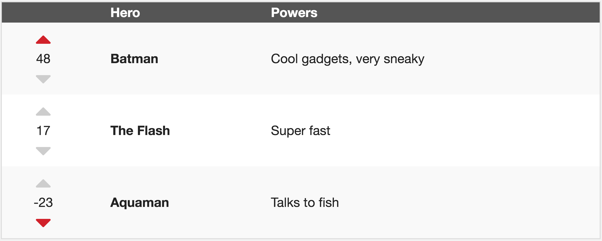
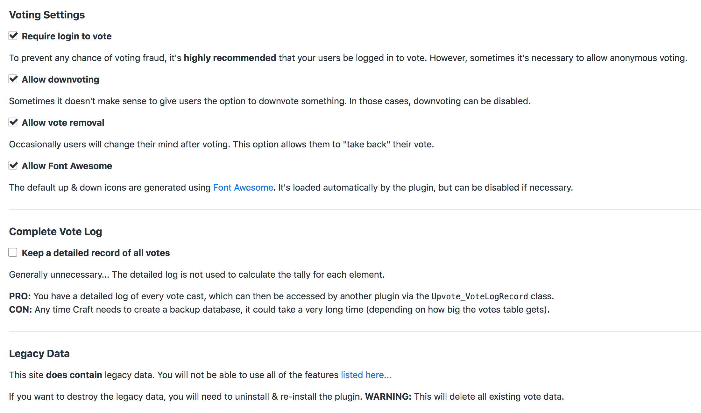

# Upvote plugin for Craft CMS

**Lets your users upvote/downvote, "like", or favorite any type of element.**

---



---

## Upvote & Downvote (similar to Stack Exchange)

Just specify the element ID of the item you want users to vote on. Any element type (Entry, Asset, User, etc) will work!

```twig
<table>
    
        <tr>
            <td>
                <div>{{ craft.upvote.upvote(entry.id) }}</div>
                <div>{{ craft.upvote.tally(entry.id) }}</div>
                <div>{{ craft.upvote.downvote(entry.id) }}</div>
            </td>
            <td>{{ entry.title }}</td>
        </tr>
    
</table>
```

## "Like" (similar to Facebook)

Very similar to the configuration described above, except with:
 - Downvoting disabled
 - Customized "up" icon

## "Favorite" (similar to a bookmarking system)

You can easily see what votes have been cast by a particular user...

```twig
craft.upvote.userHistory()
```

Read more about using the [user voting history](https://www.doublesecretagency.com/plugins/upvote/docs/user-vote-history). 

## Customize Icons

It's easy to customize your icons. You can either [adjust the CSS](https://www.doublesecretagency.com/plugins/upvote/docs/customize-your-css), or [replace the icons entirely](https://www.doublesecretagency.com/plugins/upvote/docs/customize-your-icons).

```twig

```

By default, Upvote uses the Font Awesome library. Which means you can easily swap to a different icon from the Font Awesome collection. And if you'd rather not use Font Awesome, you can disable the library from being included at all.

## Sort by Highest Voted

Once your users have cast votes, you'll want to know which items are the most popular...

```twig


```

This will grab the list of elements normally, then sort them by [highest voted](https://www.doublesecretagency.com/plugins/upvote/docs/sort-by-highest-voted).

## Settings

Here's a screenshot of the plugin's settings page...



To see some other ways that Upvote is flexible, check out the [full documentation...](https://www.doublesecretagency.com/plugins/upvote/docs)

---

## Further Reading

If you haven't already, flip through the [complete plugin documentation](https://plugins.doublesecretagency.com/upvote/).

And if you have any remaining questions, feel free to [reach out to us](https://www.doublesecretagency.com/contact) (via Discord is preferred).

**On behalf of Double Secret Agency, thanks for checking out our plugin!** 🍺

<p align="center">
    
</p>
